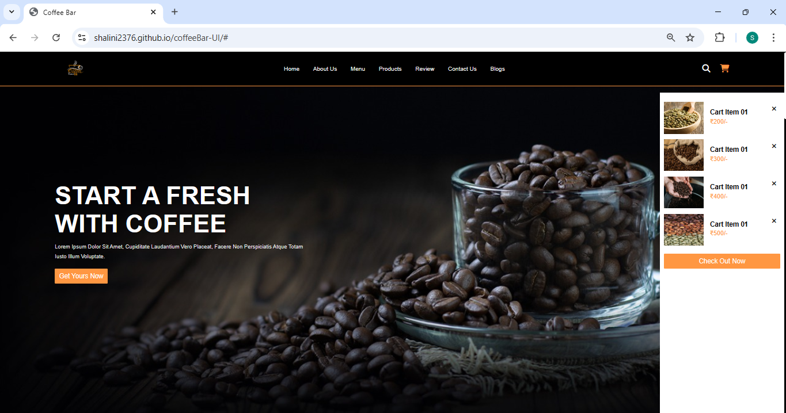
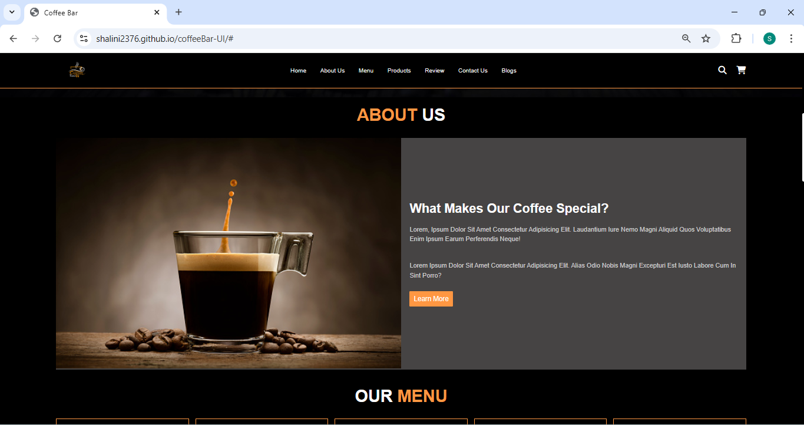
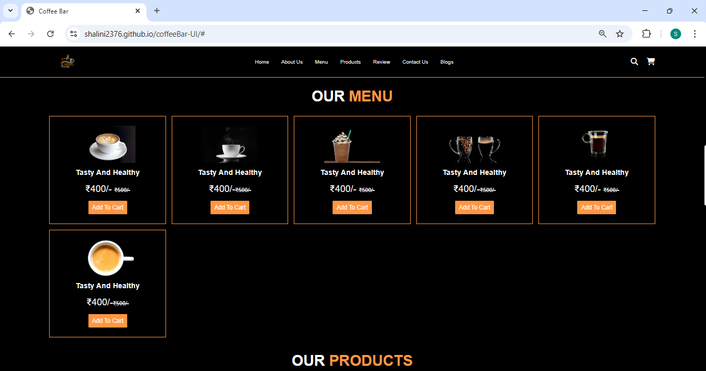
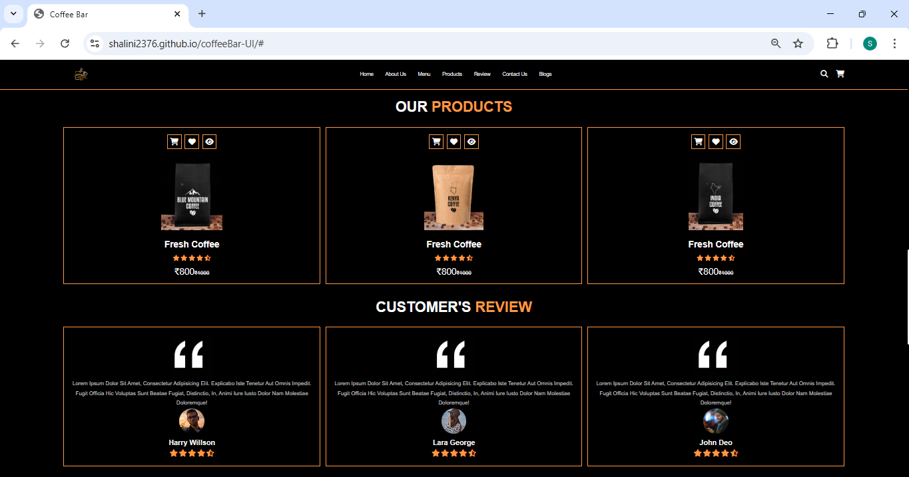
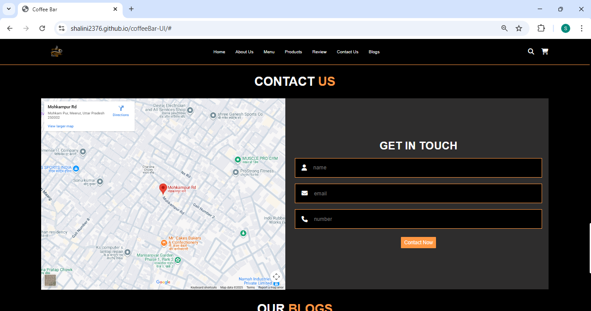

# CoffeeBar UI

CoffeeBar UI is a **responsive coffee shop website** built using **HTML, CSS, and JavaScript**.  
This project was created during the early stages of frontend learning to practice layout design, responsiveness, and UI styling.

# Live Demo
   `https://shalini2376.github.io/coffeeBar-UI`

## ✨ Features
- Fully responsive design for desktop, tablet, and mobile
- Coffee-themed multi-section layout
- Clean navigation and section flow
- Static UI with basic JavaScript interactions
- Visually focused landing-style website

## 🛠 Tech Stack
- HTML5
- CSS3
- JavaScript

## ▶️ How to Run Locally
1. Clone the repository:
   ```bash
   git clone https://github.com/shalini2376/coffeeBar-UI.git
   ```
2. Open the project folder.
3. Open index.html in your browser.

## 📸 Screenshots








